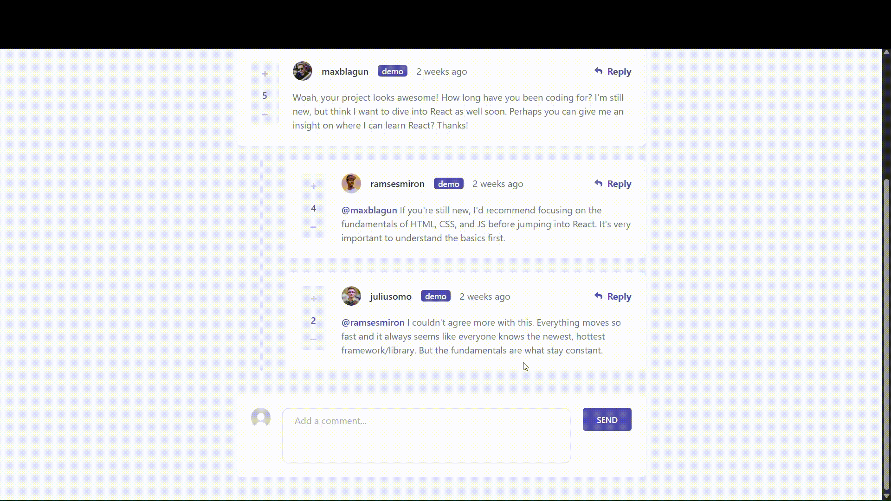

<div align="center">

# Frontend Mentor - Interactive comments section solution

This is a solution to the [Interactive comments section challenge on Frontend Mentor](https://www.frontendmentor.io/challenges/interactive-comments-section-iG1RugEG9). Frontend Mentor challenges help you improve your coding skills by building realistic projects.


<a href="https://fm-dd-interactive-comments-section.vercel.app">
  
</a>

</div>

## Table of contents

- [Overview](#overview)
  - [The challenge](#the-challenge)
  - [Demo](#demo)
  - [Links](#links)
  - [Demo data notice](#demo-data-notice)
- [My process](#my-process)
  - [Built with](#built-with)
  - [What I learned](#what-i-learned)
  - [Continued development](#continued-development)
  - [AI Collaboration](#ai-collaboration)
- [Running the app](#running-the-app)
  - [Prerequisites](#prerequisites)
  - [Environment variables](#environment-variables)
  - [Run locally](#run-locally)
  - [Useful endpoints](#useful-endpoints)
- [Author](#author)

## Overview

### The challenge

Users should be able to:

- View the optimal layout for the app depending on their device's screen size
- See hover states for all interactive elements on the page
- Create, Read, Update, and Delete comments and replies
- Upvote and downvote comments
- **Bonus**: If you're building a purely front-end project, use `localStorage` to save the current state in the browser that persists when the browser is refreshed.
- **Bonus**: Instead of using the `createdAt` strings from the `data.json` file, try using timestamps and dynamically track the time since the comment or reply was posted.
- **Bonus**: Build this project as a full-stack application

### Demo



### Links

- Solution URL: [Frontend Mentor](https://www.frontendmentor.io/solutions/interactive-comments-section---nextjs-aspnet-core-postgresql-cPpuUE-DSt)
- Live Site URL: https://fm-dd-interactive-comments-section.vercel.app

### Demo data notice

This is an educational portfolio project. The live demo allows account creation for testing the comments flow. If you register, the app stores your username, email, securely hashed password, avatar, comments, and votes. Hosting and storage are provided by Vercel (frontend), Neon Postgres (database), and S3-compatible object storage (avatars). Data is kept until you delete your account from `/profile`, which removes your profile, comments, and reactions. For questions or deletion help, contact via [GitHub](https://github.com/Denislav-Dimov) or [Frontend Mentor](https://www.frontendmentor.io/profile/Denislav-Dimov). This notice is for transparency only and is not legal advice.

## My process

### Built with

- [Next.js](https://nextjs.org/) - React framework
- [React](https://react.dev/) - JavaScript library
- [TypeScript](https://www.typescriptlang.org/) - Typed JavaScript
- [Tailwind CSS](https://tailwindcss.com/) - Utility-first CSS
- [Zod](https://zod.dev/) - Schema validation
- [C#](https://learn.microsoft.com/dotnet/csharp/) with [ASP.NET Core](https://dotnet.microsoft.com/apps/aspnet) (.NET 10) - REST API
- [Entity Framework Core](https://learn.microsoft.com/ef/core/) with [Npgsql](https://www.npgsql.org/efcore/) - ORM + PostgreSQL provider
- [ASP.NET Core Identity](https://learn.microsoft.com/aspnet/core/security/authentication/identity) with Identity Cookies - Auth (cookie auth, sign-in manager, token providers)
- [PostgreSQL](https://www.postgresql.org/) hosted on [Neon](https://neon.com/) - Database
- [Neon Object Storage](https://neon.com/docs/guides/object-storage) via [AWSSDK.S3](https://www.nuget.org/packages/AWSSDK.S3) (S3-compatible) - Avatar/file storage
- [OpenAPI](https://learn.microsoft.com/aspnet/core/fundamentals/openapi) + [Swashbuckle Swagger UI](https://github.com/domaindrive-dev/Swashbuckle.AspNetCore) - API docs
- [Docker](https://www.docker.com/) - API containerization

### What I learned

Through this project I learned how to work with Docker properly and how to build an API, including containerizing the backend, wiring it to PostgreSQL, and deploying a working frontend-to-API flow.

### Continued development

This was my first full-stack app with a frontend, backend, and database, and I'd like to continue building full-stack apps.

### AI Collaboration

I used OpenCode as a development partner throughout this project, specifically for API architecture decisions, deployment setup, and working with Docker and PostgreSQL configuration. It was also helpful for exploring UI layout options and answering routine implementation questions.

## Running the app

### Prerequisites

- .NET 10 SDK for the `api/` backend
- Node.js 20+ for the `web/` frontend
- Docker Compose for local Postgres

### Environment variables

- Copy `web/.env.example` to `web/.env`:

```bash
# web/.env
API_URL=http://localhost:5217
```

- Set the API secrets with dotnet user-secrets (run from `api/`):

```bash
cd api
dotnet user-secrets init
dotnet user-secrets set "ConnectionStrings:DefaultConnection" "Host=localhost;Port=5432;Database=interactive_comments_section;Username=postgres;Password=postgres"
dotnet user-secrets set "Storage:AccessKeyId" "<your-key>"
dotnet user-secrets set "Storage:SecretAccessKey" "<your-secret>"
dotnet user-secrets set "Storage:Endpoint" "<your-s3-endpoint>"
dotnet user-secrets set "Storage:Region" "<your-region>"
dotnet user-secrets set "Storage:Bucket" "<your-bucket>"
```

### Run locally

- PostgreSQL

```bash
docker compose up -d
```

- Api

```bash
cd ./api
dotnet run --project .
```

- Web

```bash
cd ./web
npm i
npm run dev
```

### Useful endpoints

- `GET /api/health`: DB-connected health check
- `GET /api/security/antiforgery`: issues the `X-XSRF-TOKEN` the frontend sends back as the `X-XSRF-TOKEN` header
- `GET /openapi/v1.json` plus Swagger UI in Development: API docs

## Author

- Frontend Mentor - [@Denislav-Dimov](https://www.frontendmentor.io/profile/Denislav-Dimov)
