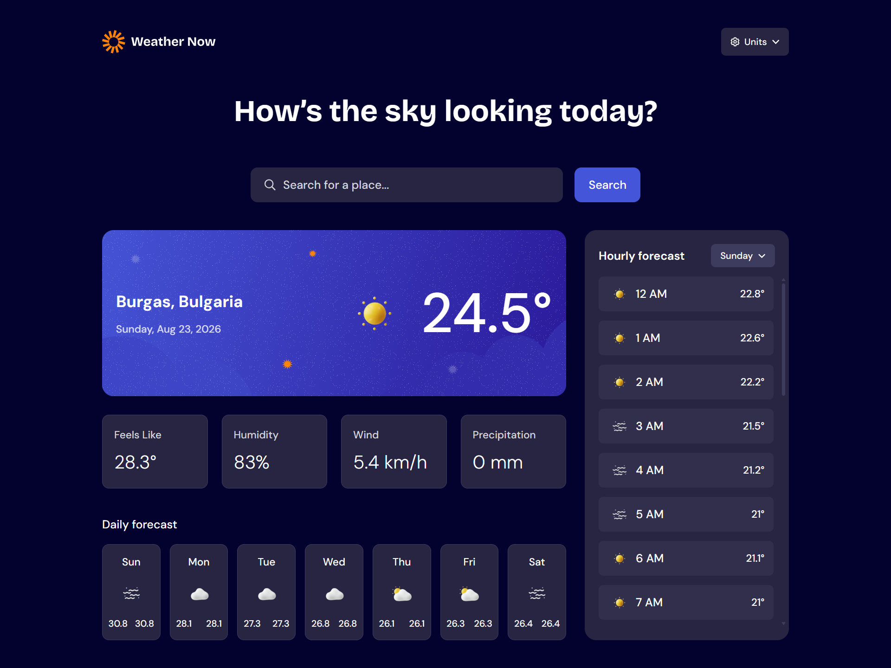

<div align="center">

# Frontend Mentor - Weather app solution

This is a solution to the [Weather app challenge on Frontend Mentor](https://www.frontendmentor.io/challenges/weather-app-K1FhddVm49). Frontend Mentor challenges help you improve your coding skills by building realistic projects.


<a href="https://denislav-dimov-weather-app.vercel.app/">
  
</a>

</div>

## Table of Contents

- [Overview](#overview)
  - [The Challenge](#the-challenge)
  - [Preview](#preview)
  - [Links](#links)
- [Getting Started](#getting-started)
  - [Prerequisites](#prerequisites)
  - [Installation](#installation)
  - [Usage](#usage)

## Overview

### The challenge

Users should be able to:

- Search for weather information by entering a location in the search bar
- View current weather conditions including temperature, weather icon, and location details
- See additional weather metrics like "feels like" temperature, humidity percentage, wind speed, and precipitation amounts
- Browse a 7-day weather forecast with daily high/low temperatures and weather icons
- View an hourly forecast showing temperature changes throughout the day
- Switch between different days of the week using the day selector in the hourly forecast section
- Toggle between Imperial and Metric measurement units via the units dropdown
- Switch between specific temperature units (Celsius and Fahrenheit) and measurement units for wind speed (km/h and mph) and precipitation (millimeters) via the units dropdown
- View the optimal layout for the interface depending on their device's screen size
- See hover and focus states for all interactive elements on the page

### Preview



### Links

- Solution URL:
- Live Site URL: https://denislav-dimov-weather-app.vercel.app/

## Getting Started

Follow these steps to set up and run the project locally.

### Prerequisites

Make sure you have the following installed:

- **Node.js** (v18 or higher)
- **npm** (v9 or higher)

### Installation

Clone this repository and install dependencies.

```bash
git clone https://github.com/Denislav-Dimov/weather-app.git
cd weather-app
npm i
```

### Usage

Run the app in development mode:

```bash
npm run dev
```
